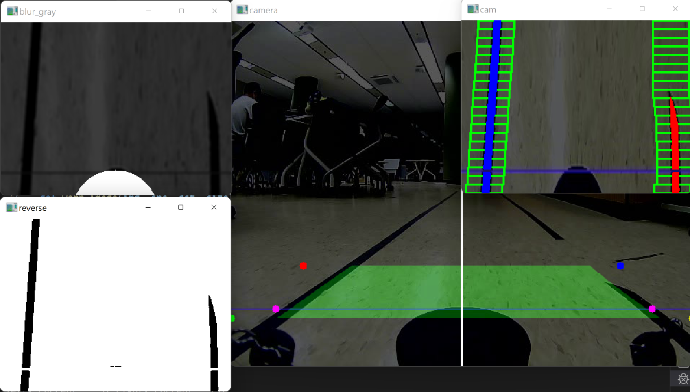
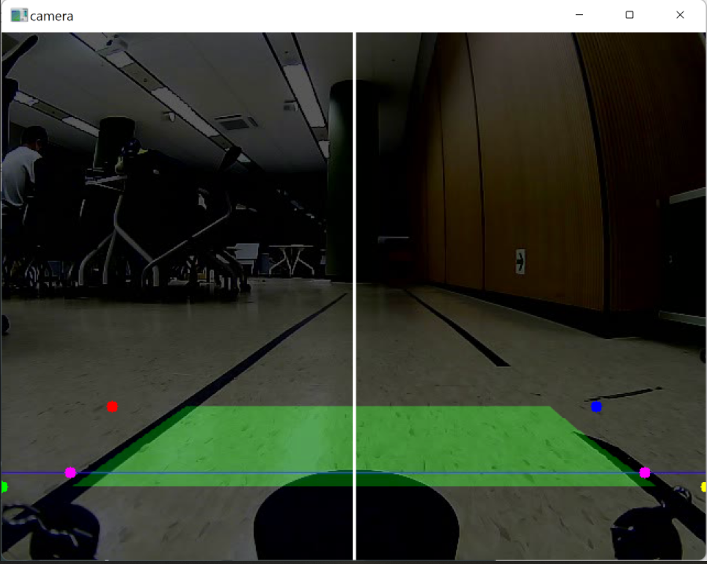
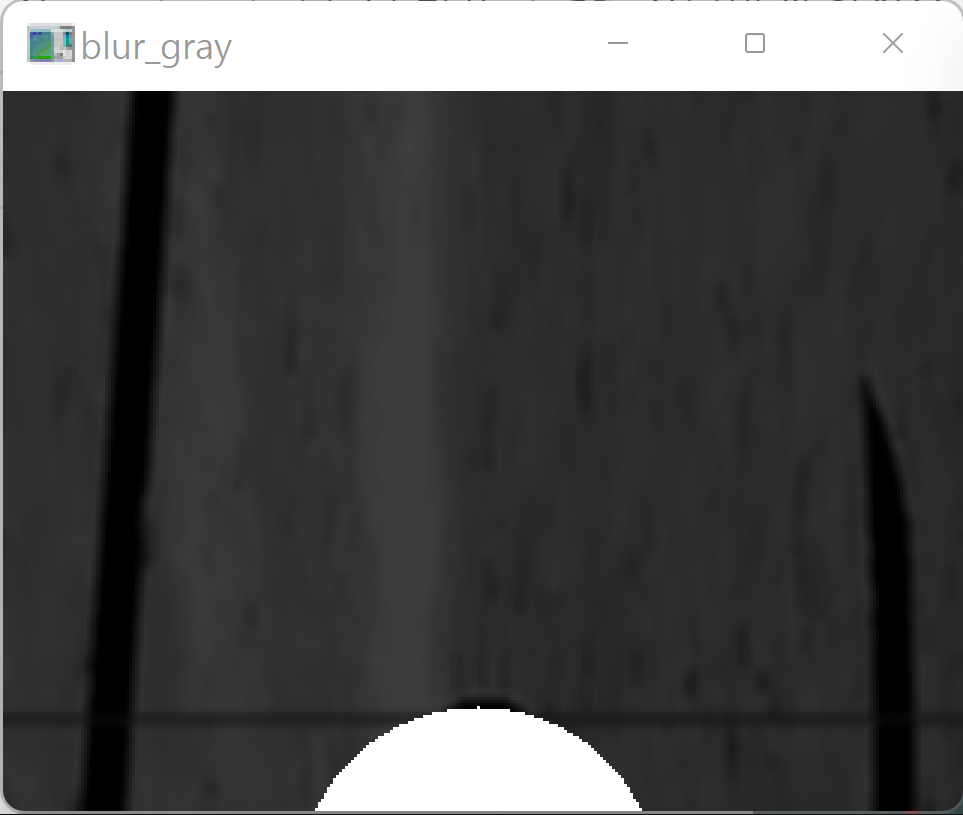
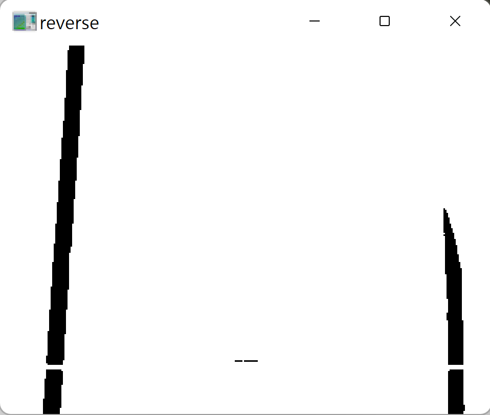
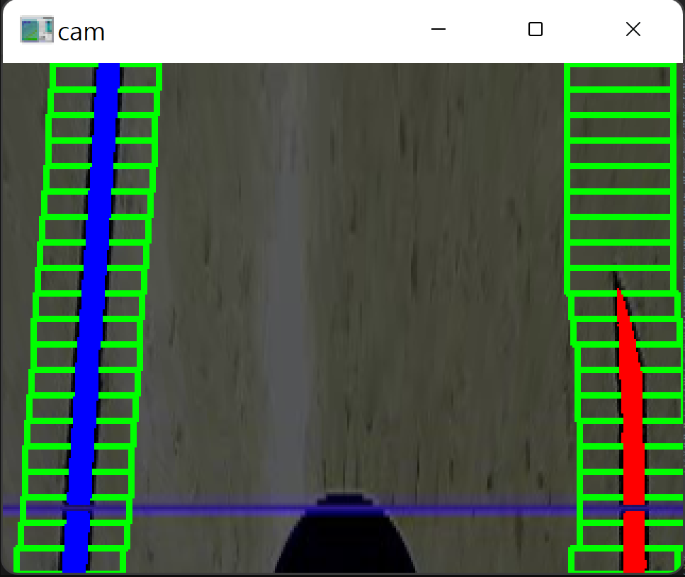
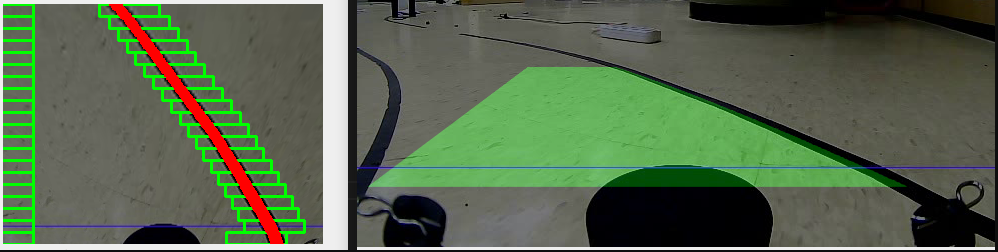
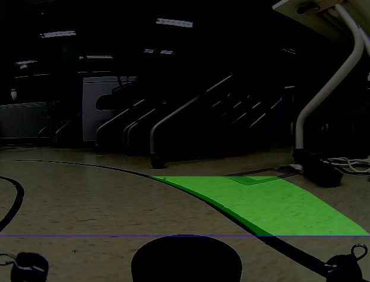
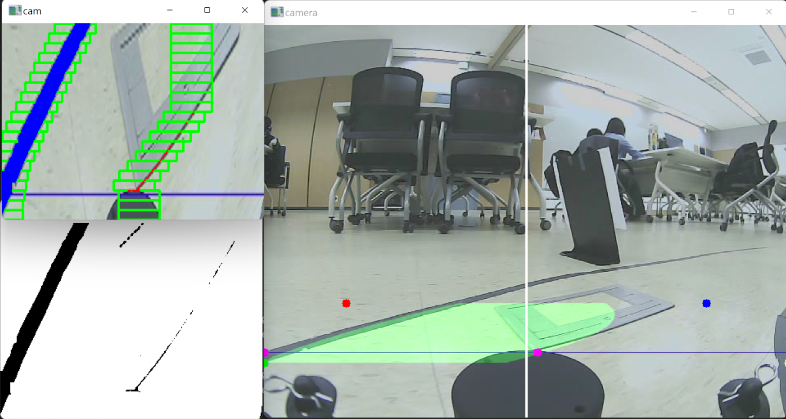
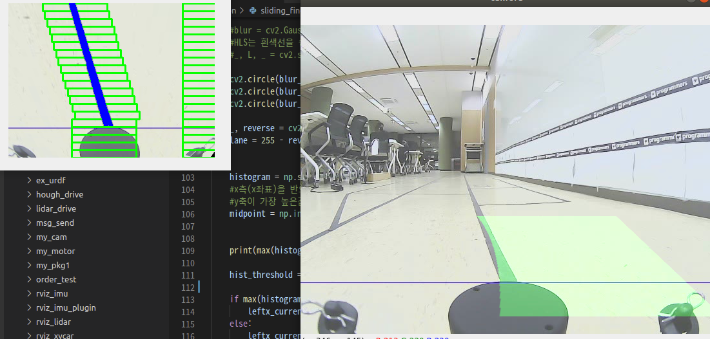

팀원 : 강수민, 왕진훈

# 차선인식심화프로젝트
처선인식 주행 프로젝트를 진행하면서 난항을 겪었던 부분이 있다. 시간이 지남에 따라 실내로 들어오는 일조량이 줄어들면서 밝기에 따라 인지화를 하는 우리 코드는 점차 차선을 인식하지 못해 종종 차선을 이탈하는 일이 있었다. 하지만 촉박한 일정에 천천히 문제를 해결할 고민을 하지 못해 아쉬웠었다. 그래서 이 프로젝트가 끝난 뒤 프로그래머스 스터디를 통해 차선인식심화 프로젝트를 진행하였다. 저번 프로젝트때 허프변환 알고리즘을 이용하였기에 이번엔 슬라이딩 윈도우 알고리즘을 적용해 보았다.


실내 환경임으로 다소 안정적이지만 밝기를 프레임마다 변경시켜 난이도가 상승되었고 사진과 같이 멘토님들이 이미 측정한 좌표값 내에 우리가 차선인식으로 추출한 좌표값이 들어가면 된다.

# 프로젝트에 사용한 알고리즘

- 슬라이딩 윈도우 차선인식
- 버드아이 뷰
- 영상 평균 밝기 유지
- 가우시안 블러링
- 영상 이진화 처리

# 프로젝트 결과

- 카메라 영상

    - 버드아이 뷰 범위표시 : 빨강, 파랑, 연두, 노랑점
    - 차선의 안쪽 범위를 원근변환을 통해 녹색으로 표시
    - 좌우 차선의 좌표 lpos, rpos를 마젠타 색으로 표시
    - 좌우 차선 구분을 위한 중앙선의 좌표 midpoint를 직전 lpos, rpos의 중앙값으로 동적으로 변환시키고 흰 선으로 표시

- 흑백 영상

    - 축소 영상의 흑백처리, 평균 밝기 처리, 가우시안 블러링 적용 직후의 영상
    - 평균 밝기는 40으로 설정
    - LiDAR가 이진화 과정에서 검은색으로 남고, 차선으로 인식되는 오류가 있어 흰색원을 임의로 추가
    ```python
    m = cv2.mean(gray)[0]
    dst = cv2.add(gray ,(40 - m))
    ```

- 이진화 영상

    - 이진화 직후의 영상
     ```python
    _, reverse = cv2.threshold(blur_gray,
     lane_bin_th, 255, cv2.THRESH_BINARY)
    ```
    - 임계값 lane_bin_th는 5로 설정
        - 밝기가 5 이상인 픽셀은 모두 흰색(255)로 변환
    - 슬라이딩 윈도우 적용은 이 영상을 반전시켜 사용함
   
- 슬라이딩 윈도우 적용 영상

    - 히스토그램의 범위가 195~204행이므로, 좌우 차선의 좌표 판단은 이 범위의 평균열 값으로 정해짐
    - hist_threshold
        - 히스토그램에서 픽셀의 합이 500이 넘지 않으면 오류로 인식하고 좌표를 양 끝으로 밀음 
    ```python
    histogram = np.sum(lane[195:205,:], axis=0)     
    
    midpoint = int((pre_rightx_current+pre_leftx_current)/2)


    hist_threshold = 500

    if max(histogram[:midpoint]) < hist_threshold:
        leftx_current = 0 
    else:
        leftx_current = np.argmax(histogram[:midpoint])

    if max(histogram[midpoint:]) < hist_threshold:
        rightx_current = 320
    else:
        rightx_current = np.argmax(histogram[midpoint:]) + midpoint

    

    pre_rightx_current = rightx_current
    pre_leftx_current = leftx_current
    ```
# 이슈 사항
- 버드 아이 뷰 범위 벗어남
    - 버드아이 뷰를 보는 사다리꼴 범위가 좌우 차선을 다 담지 못했음
    - 특히 offset 400의 양 끝에 차선이 걸릴 경우 버드아이 뷰에는 표시되지 않음 
    - 임의로 버드아이 뷰 범위를 조절해가며 인식하도록 조정함



- 버드 아이 뷰 개선
    - offset 양 끝을 보기위해 버드아이 뷰를 확장하니 장애물을 차선으로 인식함
    - offset 양 끝을 조금 놓치지만 장애물 인식이 없는 버드아이뷰를 찾음



- 노이즈 인식 : 바닥의 콘센트
    - 영상 평균 밝기, 블러링, 이진화 값을 조절해가며 노이즈를 없애고자 했지만, 하나를 바꾸면 다른 쪽에서 문제가 되는 등 조정의 어려움이 있었음
    - 최종 코드에도 노이즈가 조금 감지 됨



- 좌우 차선인식 오류
    - 급커브 및 마지막 차선이탈 부분에서 좌우 차선을 반대로 인식함

    - 중앙 구분점 midpoint를 동적으로 계산하여 해결

# 아쉬웠던점
    - 임의로 조정한 값
        - 버드아이 뷰 범위
        - 영상의 평균 밝기 설정 값
        - 가우시안 블러링 값
        - 이진화 임계값
        - 차체 인식 방지를 위한 원 추가
        - 히스토그램의 범위 및 임계값
        
        → 임의로 넣지 않고 근거있게 값을 넣을 수 없을까 아쉬움
        
    - github 사용
        - commit을 하나하나 남기지 않음
        - pr 후 merge 기능도 많이 사용하진 않았음
    - 차선 검출
        - 차선이 histogram의 범위(195~204) 안에 들어 온 다음부터 인식
        - lpos, rpos는 정확히 겹치는 점이 아니라 좌표들의 평균으로 계산
    - 동영상 재생 어려움
        - 원하는 부분만 테스트하고 싶은데 영상을 처음부터 계속 돌리면서 시간이 많이 소요 됨
